[TOC]

## 一

## 二.进程

### 1_1进程的概念组成特征

- 程序：是静态的，就是个存放在磁盘里的可执行文件，就是一系列的指令集合。
- 进程（Process）：是动态的，是程序的一次执行过程（同一个程序多次执行会对应多个进程）

1. 操作系统是这些进程的管理者，它要怎么区分各个进程？

   当进程被创建时，操作系统会为该进程分配一个唯一的、不重复的“身份证号”——PID（ProcessID，进程ID）

2. 操作系统要记录PID、进程所属用户ID（UID）（ 基本的进程描述信息，可以让操作系统区分各个进程）
   
   分配了哪些资源（可用于实现os对资源的管理）
   
   运行情况（实现os对进程的控制调度）
   
   **这些信息被保存在一个数据结构PCB（process control block）中，即进程控制块**
   
   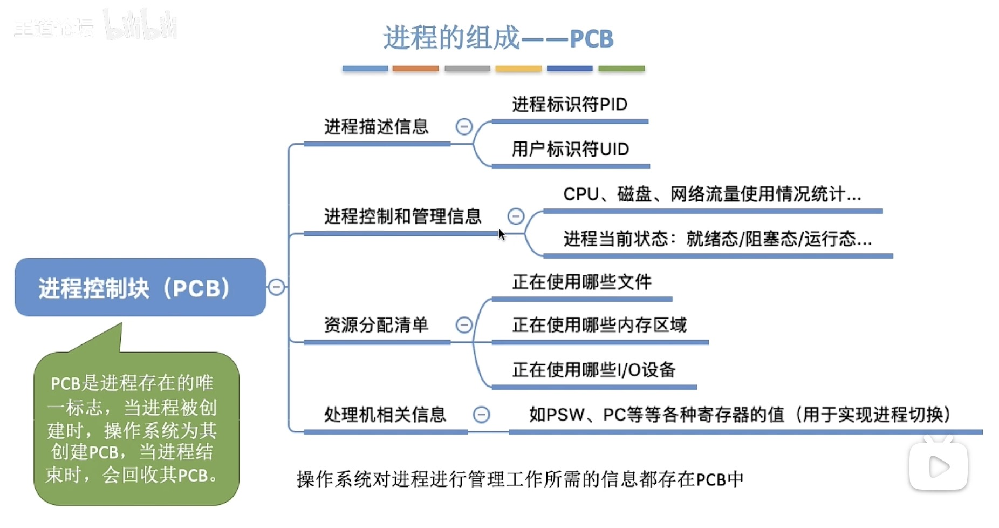
   
   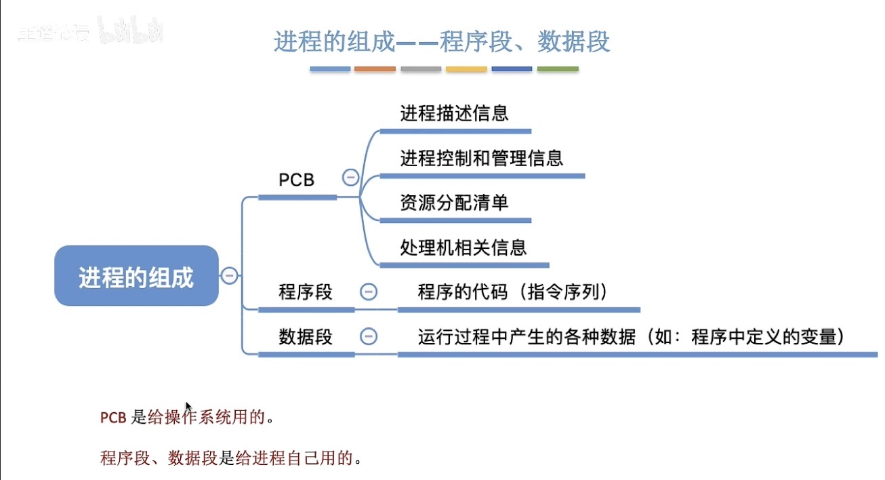
   
3. 程序段、数据段、PCB三部分组成了进程实体（进程映像）

   引入进程实体的概念后，可以把进程定义为：

   进程是进程实体的运行过程，是系统进行资源分配和调度的一个独立单位

4. 进程的特征

   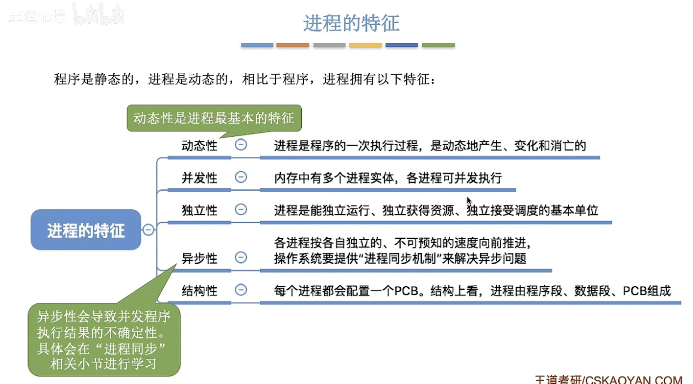

### 1_2进程的状态与转换、进程的组织

1. 进程的状态

   + 创建态：进程正在被创建时，它的状态是“创建态”，在这个阶段操作系统会为进程分配资源、初始化PCB
   + 就绪态：当进程创建完成后，便进入“就绪态”， 处于就绪态的进程已经具备运行条件，但由于没有空闲CPU，就暂时不能运行
   + 运行态：进程在cpu上运行，cpu会执行该进程对应的程序（执行指令序列）
   + 阻塞态：进程运行的过程中，可能会请求等待某个事件的发生（如等待某种系统资源的分配，或者等待其他进程的响应），在这个事件发生之前，进程无法继续往下执行，此时os会让这个进程下cpu，并让他进入“阻塞态”
   + 终止态：一个进程可以执行exit系统调用，请求操作系统终止该进程。 此时该进程会进入“终止态”，操作系统会让该进程下CPU，并回收内存空间等资源，最后还要回收该进程的PCB，当终止进程的工作完成后，这个进程就彻底消失了

2. 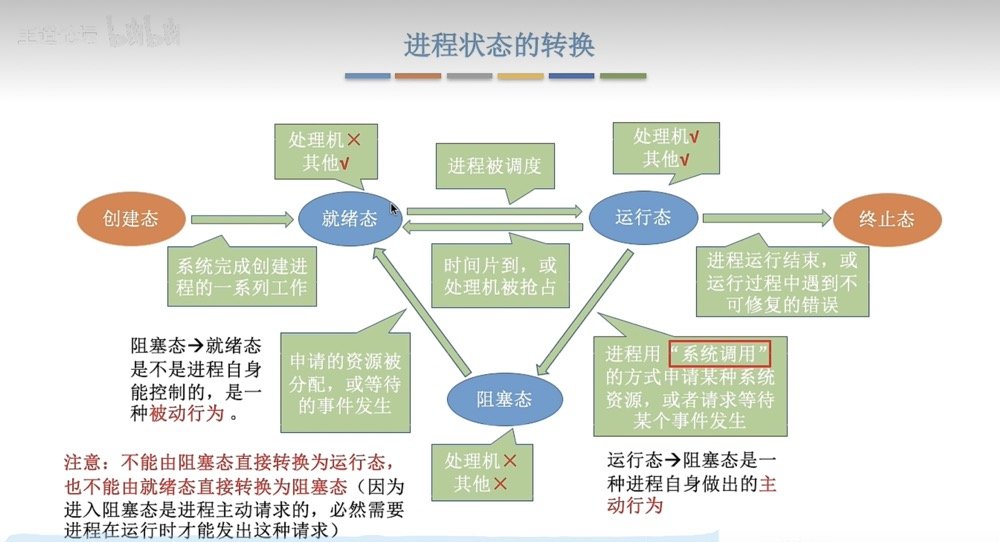

3. 进程的整个生命周期 中，大部分时间都处于三种基本状态

   + 三种基本状态

     + 运行态（Running）占有CPU，并在CPU上运行

       *单CPU情况下，同一时刻只会有一 个进程处于运行态，多核CPU情况下，可能有多个进程处于运行态*

     + 就绪态（Ready）已经具备运行条件，但由于没有空闲CPU，而暂时不能运行
     + 阻塞态（Waiting/Blocked，又称：等待态）因等待某一事件而暂时不能运行

   + 另外两种状态
     + 创建态（New，又称：新建态）进程正在被创建，操作系统为进程分配资源、初始化PCB
     + 终止态（Terminated，又称：结束态）进程正在从系统中撤销，操作系统会回收进程拥有的资源、撤销PCB

   **进程PCB中，会有一个变量state表示进程的当前状态，为了对同一状态下的各个进程进行统一管理，os会将各个进程的PCB组织起来**

4. 进程的组织

   + 链接方式

     执行指针-->PCB2

     就绪队列指针-->PCB5->PCB1

     等待打印机的阻塞队列-->PCB3

   + 索引方式

### 1_3进程控制

1. 原语的执行具有原子性，即执行过程只能一气呵成，期间不允许被中断，可以用“关中断指令”和“开中断指令”这两个特权指令实现原子性
2. CPU执行了关中断指令之后，就不再例行检查中断信号，直到执行开中断指令之后才会恢复检查。

3. 1、进程的创建：

   创建原语：申请空白PCB、为新进程分配所需资源、初始化PCB、将PCB插入就绪队列

   引起进程创建的事件：用户登录、作业调度、提供服务、应用请求

   2、进程的终止：

   撤销原语

   引起进程中止的事件：正常结束、异常结束、外界干预

   3、进程的阻塞：

   阻塞原语：运行态->阻塞态

   引起进程阻塞的事件：需要等待系统分配某种资源、需要等待相互合作的其他进程完成工作

   4、进程的唤醒：

   唤醒原语：阻塞态->就绪态

   引起进程唤醒的事件：等待的事件发生

   5、进程的切换

   切换原语

   引起进程切换的事件：当前进程事件片到、有更高优先级的进程到达、当前进程主动阻塞、当前进程终止

### 1_4 进程通信

1. 进程间通信（Inter-Process Communication,IPC）指两个进程之间产生数据交互。

2. 为什么进程通信需要os支持？

   进程是分配系统资源的单位（包括内存地址空间），因此各进程拥有的内存地址空间相互独立。

   为了保证安全，一个进程不能直接访问另一个进程的地址空间。

3. 三种进程通信：共享存储、消息传递、管道通信

   1. 共享存储：进程开辟共享存储区，为避免出错，各个进程对共享空间的访问应该是互斥的。 各个进程可使用操作系统内核提供的同步互斥工具（如P、V操作）

      > 基于数据结构的共享：比如共享空间里只能放 一个长度为10的数组。这种共享方式速度慢、限制多，是一种低级通信方式 
      >
      > 基于存储区的共享：操作系统在内存中划出一 块共享存储区，数据的形式、存放位置都由通 信进程控制，而不是操作系统。这种共享方式速度很快，是一种高级通信方式

   2. 消息传递：进程间的数据交换以格式化的消息（Message）单位。进程通过操作系统提供的“发送消息/接收消息”两个原语进行数据交换。

      1. 格式化的消息：

         > 消息头：发送进程ID，接受进程ID，信息长度等
         >
         > 信息题

      2. 消息传递：

         > 直接通信方式：消息发送进程要知名接收进程的ID
         >
         > 间接通信方式：通过“信箱”间接地通信。因此又称“信箱通信方式”

   3. 管道通信：进程P->pipe->进程Q（单向）

      “管道”是一个特殊的共享文件，又名pipe文件。其实就是在内存中开辟一个大小固定的内存缓冲区

      1. 管道只能采用半双工通信，某一时间段内只能实现单向的传输。如果要实现双向同时通信，则需要设置两个管道。

      2. 各进程要互斥地访问管道（由OS实现）

      3. 管道写满，写进程将阻塞，直到读进程取走数据

      4. 管道读空，读进程将阻塞，直到写进程写入数据

      5. 管道中数据一旦被读出，就会彻底消失，因此当多个进程读同一个管道时，可能会错乱

         > 解决方案：
         >
         > 1. 一个pipe允许多个写进程，一个读进程
         > 2. 允许多个读写进程，但系统会让各个读进程轮流从管道中读数据（linux方案）

### 1_5 线程的概念

1. 可以把线程理解“轻量级进程”。 线程是一个基本的CPU执行单元，也是程序执行流的最小单位。
2. 引入线程之后，不仅是进程之间可以并发，进程内的各线程之间也可以并发，从而进一步提升了系统的并发度，使得一个进程内也可以并发处理各种任务（如QQ视频、文字聊天、传文件）
3. 引入线程后，进程只作为除CPU之外的系统资源的分配单元（如打印机、内存地址空间等都是分配给进程的）

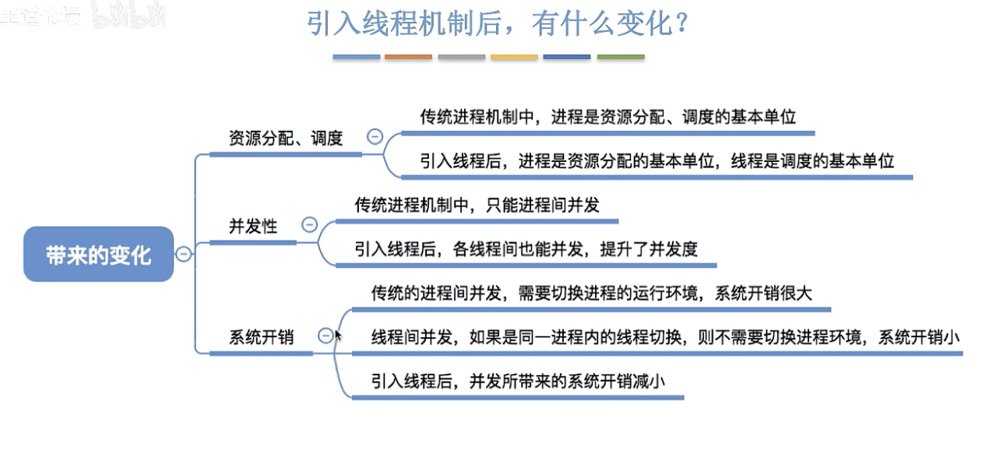

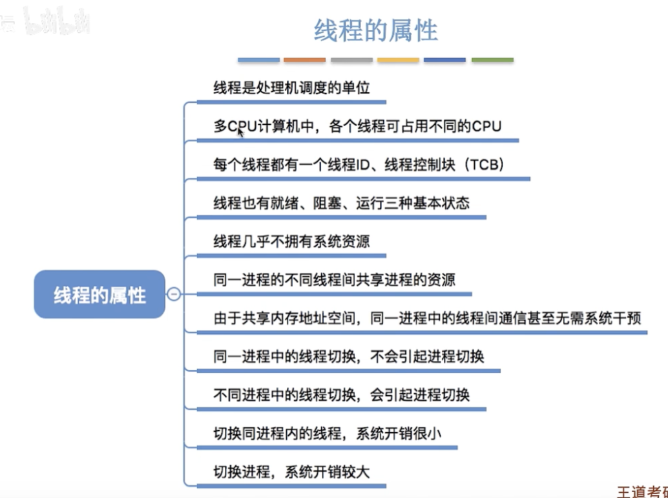

### 1_6线程实现方式

1. 用户级线程（ULT）：由线程库实现，很多编程语言提供了强大的线程库，可以实现线程的创建、销毁、调度等

2. 内核级线程（KLT）：由OS支持的线程

3. 多线程模型：

   > 一对一模型：一个用户级线程映射到一个内核级线程，每个用户进程有与用户级线程同数量的内核级线程
   >
   > 多对一模型：多个用户级线程映射到一个内核级线程，一个进程只分配给一个内核级线程
   >
   > 多对多模型：n个用户级线程映射到m个内核级线程 n≥m， 每个用户进程对应m个内核级线程
   >
   > *内核级线程才是处理机分配的单位*

### 1_7 线程的状态与转换

1. 和进程类似：就绪、运行、阻塞

2. 组织与控制：

   > TCB:线程控制块
   >
   > + 线程标识符TID
   > + 程序计数器PC：线程目前执行到哪里
   > + 其他寄存器：线程运行的中间结果
   > + 堆栈指针：堆栈保存函数调用信息、局部变量等
   > + 线程运行状态：运行、就绪、阻塞
   > + 优先级：线程调度、资源分配的参考
   >
   > *线程切换时要保存/恢复：PC、register、堆栈指针*
   >
   > 线程表：多个TCB组织成线程表

### 2_1调度的概念、层次

1. 调度：资源有限，没法同时处理事情，需要确定某种规则来决定处理任务的顺序

2. 调度的三个层次：

   + 高级调度（作业调度）：按一定的原则从外存的作业后备队列中挑选一个作业调入内存，并创建进程。每个作业只调入一次，调出一次，调入创建PCB调出撤销PCB

     > 作业：一个具体的任务

   + 低级调度（进程调度/处理机调度）：按照某种策略从就绪队列中选取一个进程

   + 中级调度（内存调度）：按照某种策略决定将哪种处于挂起状态的进程重新调入内存

     内存不足时，可以将某些进程的数据调出外存，等内存空闲或者进程需要时再重新调入内存。

     暂时调到外存等待的进程状态为挂起状态，被挂起的进程PCB会被组织成挂起队列

### 2_2调度的目标

1. cpu利用率=忙碌的时间/总时间

2. 系统吞吐量 = 总共完成了多少道作业/总共花了多少时间

3. 周转时间：作业被提交给系统开始，道作业完成为止

   > 四个部分：
   >
   > + 作业在外存后备队列上的等待作业调度（高级调度）的时间
   > + 进程在就绪队列上等待进程的调度（低级调度）的时间
   > + 进程在CPU上执行的时间
   > + 进程等待IO操作完成的时间
   >
   > *后三项在一个作业的整个处理过程中，可能发生多次*
   >
   > （作业）周转时间=作业完成时间-作业提交时间
   >
   > 平均周转时间：各作业周转时间之和/作业数
   >
   > 带权周转时间 = 作业周期时间/作业实际运行的时间 = （作业完成时间 - 作业提交时间）/作业实际运行的时间≥1
   >
   > 平均带权周转时间：各作业的带权周转时间之和/作业数

4. 等待时间：作业/进程等待处理机状态时间之和

5. 响应时间：用户提交请求到首次产生响应所用的时间

### 2_3 进程调度的时机、切换过程和方式

1. 进程调度

   > 需要进程调度：进程主动、被动放弃处理机
   >
   > 不能进程调度：处理中断、进程在OS内核程序临界区中、在原子操作过程中

   *临界资源：一个时间段内只允许一个进程使用的资源，各进程需要互斥地访问*

   *临界区：访问临界资源的那段代码*

2. 进程调度的方式

   + 非剥夺调度方式：非抢占式，只允许进程主动放弃处理机
   + 剥夺调度方式：抢占方式

3. 进程的切换与过程

   进程切换主要完成了：对原来运行进程各种数据保存、对新进程各种数据的恢复

   进程切换有代价

### 2_4 调度器/调度程序

1. 不支持内核级线程的OS，调度程序的处理对象是进程

   支持内核级线程的OS，调度程序处理对象是内核线程，进程作为资源分配的基本单位

2. 闲逛进程：调度程序永远的备胎，没有其他就绪进程时，运行闲逛程序（idle）

   > 特点：优先级最低、可以是0地址指令，占一个完整的指令周期、能耗低

3. 调度算法：

   > + 先来先服务（FCFS）：用于作业调度时，考虑的是哪个作业先到达后备队列；用于进程调度时，考虑的是哪个进程先到达就绪队列
   >
   > ​	非抢占式算法
   >
   > ​	*周转时间 = 完成时间 - 到达时间*
   >
   > ​	*带权周转时间 = 周转时间/运行时间*
   >
   > ​	*等待时间 = 周转时间- 运行时间（ - I/O操作时间）*
   >
   > ​	不会导致饥饿（某进程/作业长期得不到服务）
   >
   > + 短作业优先（SJF，Shortest Job First）：最短的作业/进程优先得到服务（最短：要求服务时间最短）
   >
   > ​	用于进程调度时可称为短进程优先（SPF，Shortest Process First）
   >
   > ​	非抢占式算法（也有抢占式短作业优先算法）
   >
   > ​	选择当前已到达的运行时间最短的作业/线程
   >
   > ​	最短剩余时间优先算法（SRTN）：新到达的进程剩余时间比当前运行的进程剩余时间短，则由新进程抢	占处理机
   >
   > ​	可能导致长作业的饥饿现象，一直得不到服务，则会产生"饿死"现象，作业/进程的运行时间由用户提供，不	一定真实，不一定做到真正的短作业优先
   >
   > + 高响应比优先算法（HRRN，Highest Response Ratio Next）：在每次调度时先计算各个作业/进程的响应比，选择响应比最高的作业/进程为其服务
   >
   > ​	响应比 = （等待时间 + 要求服务时间）/ 要求服务时间 （≥1）
   >
   > ​	非抢占式算法
   >
   > + 时间片轮转调度算法（RR，Round-Robin）：按照各个进程到达就绪队列的顺序，轮流让各个进程执行一个时间片（如100ms）若进程未在一个时间片内执行完，则剥夺处理机，将进程重新放到就绪队列队尾重新排序
   >
   > ​	用于进程调度（只有作业放入内存建立了相应的进程后，才能被分配处理机时间片）
   >
   > ​	抢占式算法，由时钟装置发出时钟中断来通知CPU时间片已到
   >
   > ​	进程主动放弃处理机也会发生调度
   >
   > ​	若时间片太大，RR会退化为FCFS（切换进程开销占比不超过1%）
   >
   > ​	不会导致饥饿
   >
   > + 优先级调度算法：每个作业/进程有各自优先级，按照优先级顺序调度
   >
   > ​	可用于作业调度、进程调度甚至I/O调度
   >
   > ​	抢占式、非抢占式都有：非抢占式只许在进程主动放弃处理机时调度即可，抢占式还需在就绪队列变化时，	检查是否会发生抢占
   >
   > ​	静态优先级：创建进程时确定，之后不变
   >
   > ​	动态优先级：创建进程时有一个初始值，之后会根据情况动态地调整优先级
   >
   > ​	通常系统进程优先级高于用户进程，前台进程优先级高于后台进程，OS更偏好I/O型进程（或称I/O繁忙型进	程）
   >
   > ​	*与I/O型进程相对的是计算型进程（或称CPU繁忙型进程）*
   >
   > ​	可以从追求公平、提升资源利用率等角度考虑，如果某进程在就绪队列等待了很长时间、多次I/O操作，则	可以适当提升其优先级，如果某进程占用处理机运行了很长时间，则可以适当降低其优先级
   >
   > + 多级反馈队列算法：
   >
   >   用于进程调度
   >
   >   抢占式算法
   >
   >   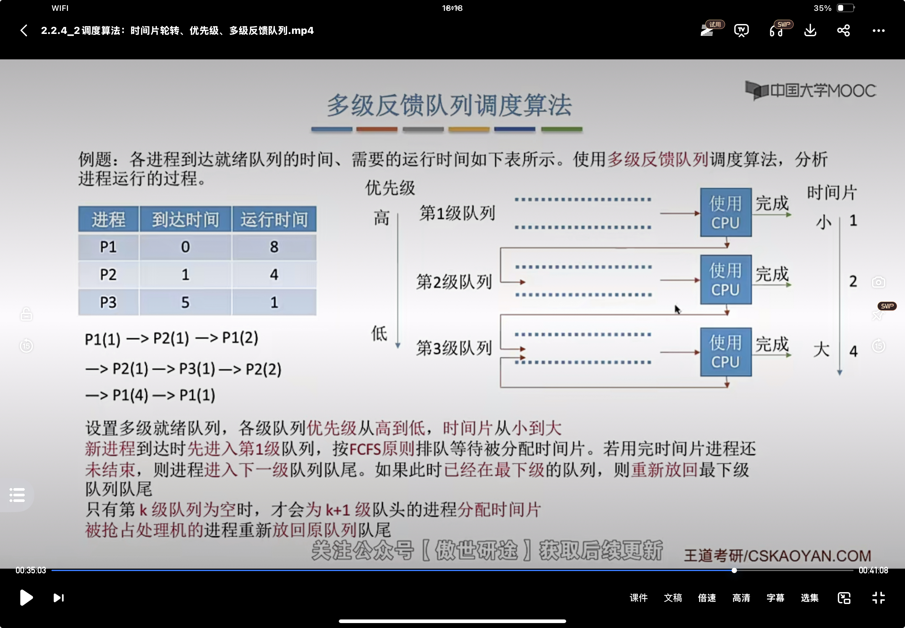
   >
   >   可能导致饥饿
   >   
   > + 多级队列调度算法：
   >
   >   系统按照进程类型设置多个队列，进程创建成功后插入某个队列
   >
   >   比如：系统进程、交互式进程、批处理进程（优先级从高到低）
   >
   >   可采用固定优先级（高优先级空时低优先级进程才能被调度）或时间片划分（比如三个队列分配时间50%、40%、10%）
   >
   >   各队列可采用不同的调度策略，如：
   >   
   >   ​	系统进程队列采用优先级调度
   >   
   >   ​	交互式队列采用RR
   >   
   >   ​	批处理采用FCFS
   >   

### 3_1 进程同步、进程互斥

1. 同步亦称直接制约关系，它是指为完成某种任务而建立的两个或多个进程，这些进程因为需要在某些位置上协调它们的工作次序而产生的制约关系。进程间的直接制约关系就是源于它们之间的相互合作。

   

2. 对临界资源的互斥访问，可以在逻辑上分为如下四个部分：

   `````cpp
   do{
   	entry section;		//进入区(正在访问临界资源的标志，上锁)
   	critical section;	//临界区（访问临界资源的代码）
   	exit section;		//退出区（解锁）
   	remainder section;	//剩余区（做其他处理）
   } while(true)
   `````

3. 为了实现对临界资源的互斥访问，同时保证系统整体性能，需要遵循以下原则：
   1.空闲让进。临界区空闲时，可以允许一个请求进入临界区的进程立即进入临界区：
   2.忙则等待。当已有进程进入临界区时，其他试图进入临界区的进程必须等待：
   3.有限等待。对请求访问的进程，应保证能在有限时间内进入临界区（保证不会饥饿）：
   4.让权等待。当进程不能进入临界区时，应立即释放处理机，防止进程忙等待。
4. 

### 3_2进程互斥的软件实现方法

1. 单标志法：

   算法思想：两个进程在访问完临界区后会把使用临界区的权限转交给另一个进程。也就是说每个进程进入临界区的权限只能被另一个进程赋予。

   ``````cpp
   int turn = 0;	//turn 表示当前允许进入临界区的进程号
   P0进程：
   while(turn != 0);	//进入区①
   critical section;	//临界区②
   turn = 1;			//退出区③
   remainder section;	//剩余区④
   
   P1进程：
   while(turn != 1);	//⑤
   critical section;	//⑥
   turn = 0;			//⑦
   remainder section;	//⑧
   ``````

   turn的初值为0，即刚开始只允许0号进程进入临界区。
   若P1先上处理机运行，则会一直卡在⑤。直到P1的时间片用完，发生调度，切换P0上处理机运行。
   代码①不会卡住P0,P0可以正常访问临界区，在P0访问临界区期间即时切换回P1,P1依然会卡在⑤。

   因此，该算法可以实现“同一时刻最多只允许一个进程访问临界区”

   **违反空闲让进**

2. 双标志先检查法：

   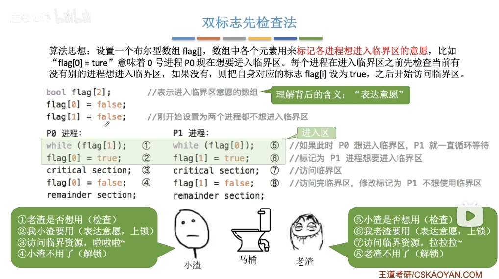

   **违反忙则等待**

   原因在于，进入区的“检查”和“上锁”两个处理不是一气呵成的。“检查”后，“上锁”前可能发生进程切换。

3. 双标志后检查法：

   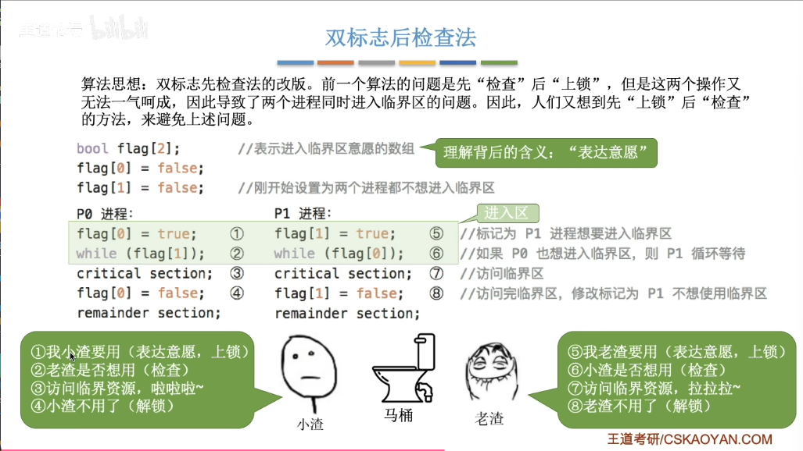

   若按照①⑤②⑥.的顺序执行，P0和P1将都无法进入临界区

   因此，双标志后检查法虽然解决了“忙则等待”的问题，但是又违背了“空闲让进”和“有限等待”原则，会因各进程都长期无法访问临界资源而产生“饥饿”现象。

4. Peterson算法

   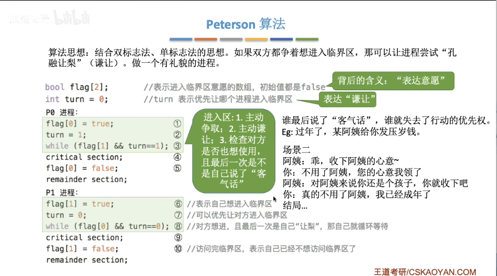

   Peterson算法用软件方法解决了进程互斥问题，遵循了空闲让进、忙则等待、有限等待三个原则，但是依然未遵循让权等待的原则。

### 3_2.进程互斥的硬件实现方法

1. 中断屏蔽方法：利用“开/关中断指令”实现（与原语的实现思想相同，即在某进程开始访问临界区到结束访问为止都不允许被中断，也就不能发生进程切换，因此也不可能发生两个同时访问临界区的情况)

   ``````
   ...
   关中断；
   临界区；
   开中断；
   ...
   ``````

   优点：简单、高效
   缺点：不适用于多处理机：只适用于操作系统内核进程，不适用于用户进程（因为开/关中断指令只能运行在内核态，这组指令如果能让用户随意使用会很危险)

2. TestAndSet指令

   简称TS指令，也有地方称为TestAndSetLock指令，或TSL指令

   TSL指令是用硬件实现的，执行的过程不允许被中断，只能一气呵成。以下是用C语言描述的逻辑
   ``````cpp
   //布尔型共享变量lock表示当前临界区是否被加锁
   //true表示已加锁，false表示未加锁
   bool TestAndSet (bool *lock){
   	bool old;
   	old *lock;	//1old用来存放lock原来的值
   	*lock=true;	//无论之前是否已加锁，都将lock设为true
   	return old;//返回lock原来的值
   }
   
   ``````

   ``````cpp
   //以下是使用TSL指令实现互斥的算法逻辑
   while(TestAndSet(&lock));//"上锁并“检查"
   临界区代码段，，
   lock false;	//解锁
   剩余区代码段，，
   ``````

   相比软件实现方法，TSL指令把“上锁”和“检查”操作用硬件的方式变成了一气呵成的原子操作。

   优点：实现简单，无需像软件实现方法那样严格检查是否会有逻辑漏洞：适用于多处理机环境

   缺点：不满足“让权等待”原则，暂时无法进入临界区的进程会占用CPU并循环执行TSL指令，从而导致“忙等”

3. Swap指令

   有的地方也叫Exchange指令，或简称XCHG指令。
   Swap指令是用硬件实现的，执行的过程不允许被中断，只能一气呵成。以下是用c语言描述的逻辑

   ``````cpp
   //以下是用Swap指令实现互斥的算法逻辑
   //Lock表示当前临界区是否被加锁
   bool old true;
   while (old ==true)
   	Swap (&lock,&old);
   临界区代码段，，，
   lock false;
   剩余区代码段，，，
   ``````

   和TSL一样

### 3_3.互斥锁

1. 解决临界区最简单的工具就是互斥锁(mutex lock)。一个进程在进入临界区时应获得锁；在退出临界区时释放锁。函数acquire()获得锁，而函数release()释放锁。
   每个互斥锁有一个布尔变量available,表示锁是否可用。如果锁是可用的，调用acqiure()会成功，且锁不再可用。当一个进程试图获取不可用的锁时，会被阻塞，直到锁被释放。

2. `````cpp
   acquire(){
   	while(!available);		//忙等待
   	availvble = false;		//获得锁
   }
   release(){
       available = true;		//释放锁
   }
   `````

3. acquire()或release()的执行必须是原子操作，因此互斥锁通常采用硬件机制来实现。
   互斥锁的主要缺点是忙等待，当有一个进程在临界区中，任何其他进程在进入临界区时必须连续循环调用acquire()。当多个进程共享同一CPU时，就浪费了CPU周期。因此，互斥锁通常用于多处理器系统，一个线程可以在一个处理器上等待，不影响其他线程的执行。

   需要连续循环忙等的互斥锁，都可称为自旋锁(spin lock),如TSL指令、swap指令、单标志法

4. 特性：
   需忙等，进程时间片用完才下处理机，违反“让权等待”
   优点：等待期间不用切换进程上下文，多处理器系统中，若上锁的时间短，则等待代价很低
   常用于多处理器系统，一个核忙等，其他核照常工作，并快速释放临界区
   不太适用于单处理机系统，忙等的过程中不可能解锁

### 3_4.信号量机制

1. 用户进程可以通过使用操作系统提供的一对原语来对信号量进行操作，从而很方便的实现了进程互斥、进程同步。
   信号量其实就是一个变量（可以是一个整数，也可以是更复杂的记录型变量），可以用一个**信号量来表示系统中某种资源的数量**，比如：系统中只有一台打印机，就可以设置一个初值为1的信号量。

   原语是一种特殊的程序段，其执行只能一气呵成，不可被中断。原语是由关中断/开中断指令实现的。软件解决方案的主要问题是由“进入区的各种操作无法一气呵成”，因此如果能把进入区、退出区的操作都用“原语”实现，使这些操作能“一气呵成”就能避免问题。

   一对原语：wait(S)原语和signal(S)原语，可以把原语理解为我们自己写的函数，函数名分别为wait和signal,.括号里的信号量S其实就是函数调用时传入的一个参数。
   wait、signal原语常简称为P、V操作（来自荷兰语proberen和verhogen)。因此，做题的时候常把wait(s)、signal(s)两个操作分别写为P(S)、V(S)

2. 用一个整数型的变量作为信号量，用来表示系统中某种资源的数量。Eg:某计算机系统中有一台打印机…

   与普通整数变量的区别：对信号量的操作只有三种，即初始化、P操作、V操作

   ``````cpp
   int S=1;	//初始化整型信号量s,表示当前系统中可用的打印机资源数
   void wait(int S){	//wait原语，相当于"进入区
   	while (S < 0);	//如果资源数不够，就一直循环等待
   	S=S-1；	//如果资源数够，则占用一个资源
   }
   void signal（int S){	//signal原语，相当于“退出区"
   S=S+1;		//使用完资源后，在退出区释放资源
   }
   进程P0:
   wait(S);//进入区，申清资源
   使用打印机资源，，，//临界区，访问资源
   signal(S);//退出区，释放资源
   ``````

3. 整型信号量的缺陷是存在“忙等”问题，因此人们又提出了“记录型信号量”，即用记录型数据结构表示的信号量。

   ``````cpp
   /*记录型信号量的定义*/
   typedef struct{
   	int value;//剩余资源数
   	struct process*L;//等待队列
   }semaphore;
   /*某进程需要使用资源时，通过wait原语申请*/
   void wait (semaphore s){
   	S.value--;
   	if (S.value 0 )
   		block (S.L);
   }
   /*进程使用完资源后，通过s1gnal原语释放*/
   void signal (semaphore s){
   	s.value++;
   	if (S.value <=0){
   		wakeup(S.L);
   }
   ``````


### 3_6用信号量实现进程同步、互斥、前驱关系

1. 信号量的值=这种资源的剩余数量（信号量的值如果小于0，说明此时有进程在等待这种资源）

   P(S)一一申请一个资源S,如果资源不够就阻塞等待

   VS)一一释放一个资源S,如果有进程在等待该资源，则唤醒一个进程

2. 互斥：

   1.分析并发进程的关键活动，划定临界区（如：对临界资源打印机的访问就应放在临界区）
   2.设置互斥信号量mutex.初值为1

   3.在进入区P(mutex)一一申请资源
   4.在退出区V(mutex)-一释放资源

   `````cpp
   /*记录型信号量的定义*/
   typedef struct{
   	int value;	//剩余资源数
   	struct process*L;	//等待队列
   }semaphore;
   `````


​	注意：对不同的临界资源需要设置不同的互斥信号量。
​	P、V操作必须成对出现。缺少P(mutex)就不能保证临界资源的互斥访问。缺少	V(mutex)会导致资源永不被释放，等待进程永不被唤醒。

3. 同步：要让各并发进程按要求有序地推进。

   用信号量实现进程同步：

   1. 分析什么地方需要实现“同步关系”，即必须保证“**一前一后**”执行的两个操作（或两句代码）
   2. 设置同步信号量S,初始为0
   3. **在“前操作”之后执行V(S)**
   4. **在“后操作”之前执行P(S)**

   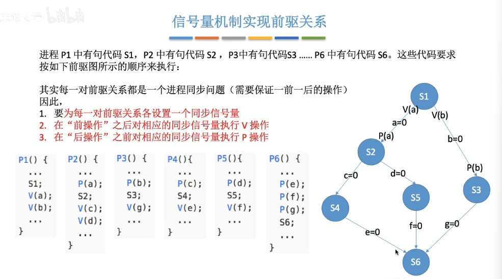

4. 
